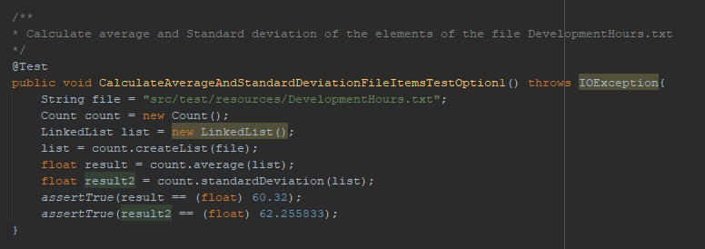
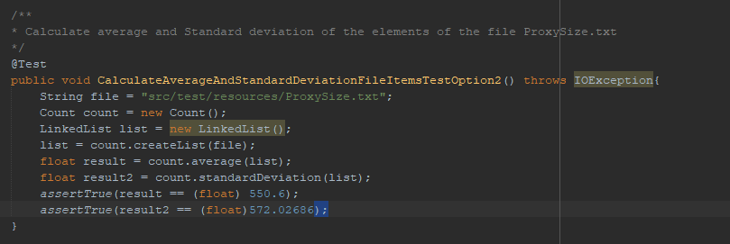
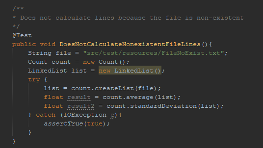
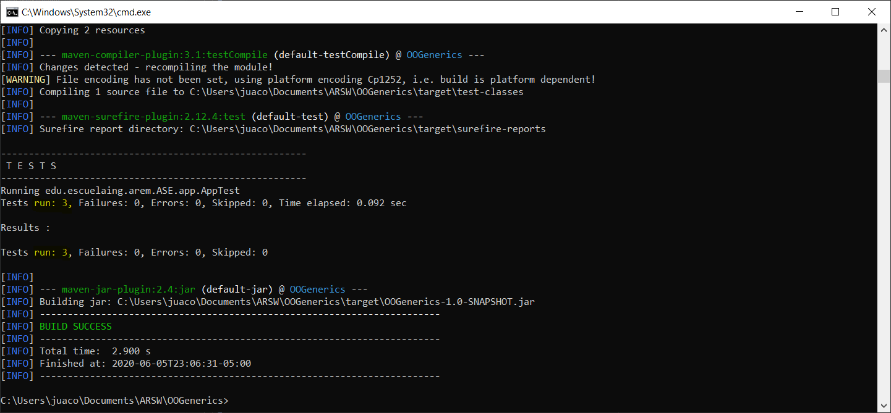
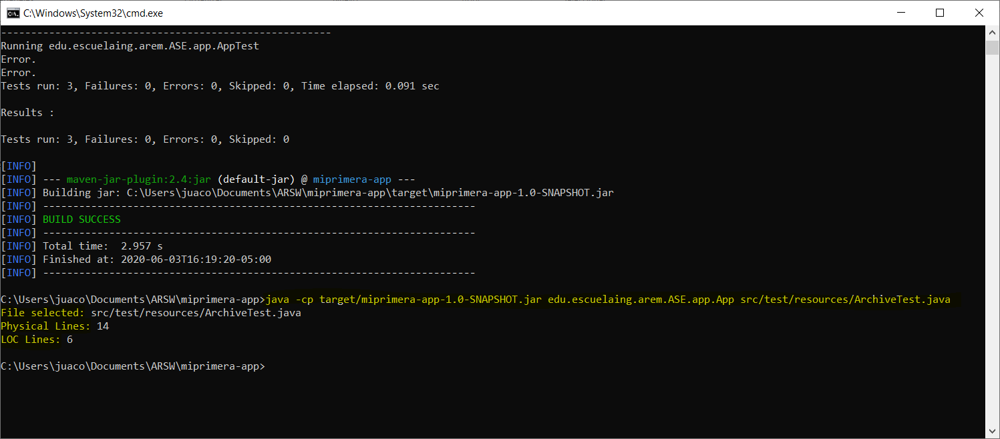

# HOMEWORK 2 ARSW (OO Design)

Write a program to calculate the mean and standard deviation of a set of n real numbers.

# LOC/H

1. 7:00 am - 12:00 pm - fueron en total  172 LOC
2. 2:00 pm - 4:40 pm - fueron en total  143 LOC
Total LOC (315/7) =  45 LOC

# DESIGN


# TEST REPORT




## TOTAL TEST


# START

Copy the project through git clone in any direction to start working:
```
git clone https://github.com/Juaco9502/ARSW-Dise-oDeSistemas-OO.git
```

## PRE-REQUISITES

* Java jdk > 7
* Maven (Apache Maven)
* Git

## INSTALL

1. Run in terminal:

```
$$ mvn package
```
2.(Optional):
If you want to view the documentation of the application, execute the following command and check the following path: root / target:

```
mvn javadoc:javadoc
```

3. (Run):
The following command must be used in the project root folder:
  
```
java -cp target/OOGenerics-1.0-SNAPSHOT.jar edu.escuelaing.arem.ASE.app.App src/test/resources/ProxySize.txt
```

```
java -cp target/OOGenerics-1.0-SNAPSHOT.jar edu.escuelaing.arem.ASE.app.App src/test/resources/DevelopmentHours.txt
```


  

## BUILT

* [Maven](https://maven.apache.org/) - Dependency Management
* [JAVA JDK 8](http://www.oracle.com/technetwork/java/javase/overview/index.html) - Building
* [JUnit 3.8.1](https://mvnrepository.com/artifact/junit/junit/3.8.1) - Test


## AUTHOR

* **JUAN CAMILO ORTIZ MEDINA** - [Juaco9502](https://github.com/juaco9502)


## LICENSE

This project is licensed under the GNU General Public License - [LICENSE](LICENSE) 